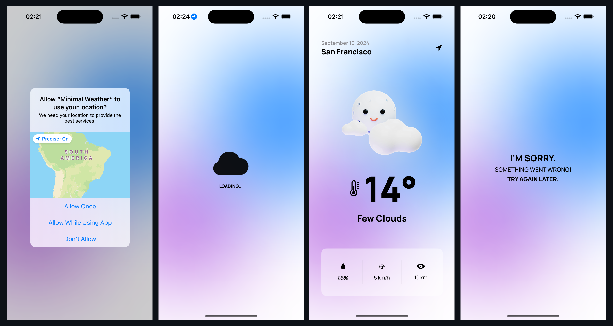

# Minimal Weather - iOS

Minimal Weather is a simple iOS weather app built using Swift and SwiftUI. The app fetches weather data from the OpenWeather API and displays it in a clean, user-friendly interface. This project utilizes Alamofire for network requests and organizes the code using various architectural patterns.


> Weather images and design inspiration: [Figma - Mikołaj Niżnik :: 3D Weather icons](https://www.figma.com/community/file/1023658389987124693/mikoaj-niznik-3d-weather-icons)

## Features

- Fetch current weather data from OpenWeather API
- Display weather information with a minimalist design
- Efficient networking with Alamofire
- Clean code architecture with Factory, Modifiers, Managers, and Services

## Tech Stack

- **Swift**: Programming language
- **SwiftUI**: User interface framework
- **Alamofire**: Networking library
- **OpenWeather API**: Weather data provider

## Architecture

- **Factory**: Responsible for creating instances of view models.
- **Modifiers**: Custom SwiftUI view modifiers for reusable styling.
- **Managers**: Handle application logic and data processing.
- **Services**: Manage network requests and data parsing.
- **Config.xcconfig**: Configuration file for managing API key.

## Setup

1. **Clone the repository:**

    ```bash
    git clone https://github.com/thrsouza/min-weather-app.git
    cd min-weather-app
    ```

2. **Open the project in Xcode:**

    Double-click on `MinWeather.xcodeproj` to open the project.

3. **Set up the API Key:**

    - Open `Config.xcconfig` and replace `API_KEY` with your actual OpenWeather API key.

4. **Run the app:**

    Select a simulator or a device and click the "Run" button in Xcode.

## Usage

- Launch the app to view current weather conditions based on your location.
- Use the search functionality to check weather in different locations.

## Screenshots



## Contributing

Feel free to open issues or submit pull requests if you'd like to contribute to the development of Minimal Weather.


## Contact

For any questions or feedback, please contact [dev@thiagosouza.com](mailto:dev@thiagsouza.com).

